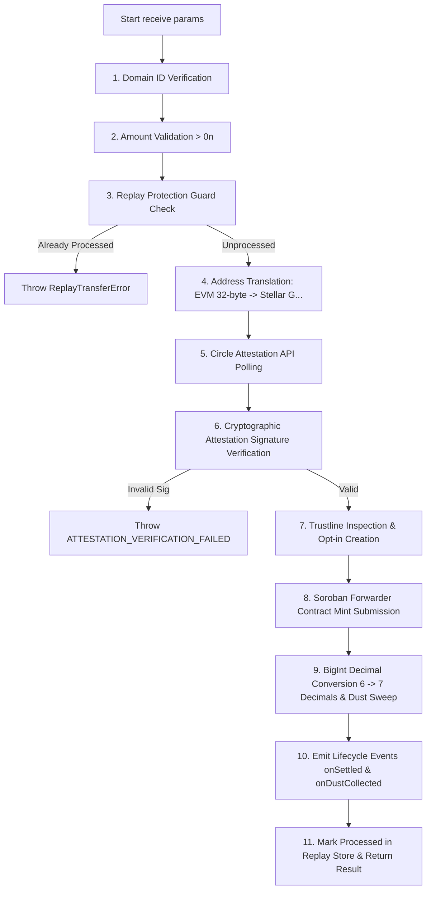

# System Architecture, Logic Specification, and Formal Proofs: AnchorCCTP SDK

## 1. Complete Project Directory Structure

```
anchorcctp-sdk/
├── .agents/
│   └── skills/
│       ├── cctp-cli-contracts/
│       │   └── SKILL.md
│       ├── cctp-stellar-core/
│       │   ├── SKILL.md
│       │   └── rules/
│       │       ├── architecture.md
│       │       ├── attestation-polling.md
│       │       ├── cli-contracts.md
│       │       ├── decimals-and-dust.md
│       │       ├── domain-registry.md
│       │       ├── error-handling.md
│       │       ├── event-emitter.md
│       │       ├── forwarder-contracts.md
│       │       ├── freighter-integration.md
│       │       ├── replay-protection.md
│       │       ├── security-checklist.md
│       │       ├── sep-cctp-standards.md
│       │       ├── stellar-toml.md
│       │       ├── testing-tdd.md
│       │       └── trustline-management.md
│       ├── graphify/
│       │   └── SKILL.md
│       └── sep-cctp-standards/
│           └── SKILL.md
├── apps/
│   └── demo/
│       ├── index.html
│       ├── package.json
│       ├── postcss.config.js
│       ├── src/
│       │   ├── App.jsx
│       │   ├── components/
│       │   ├── main.jsx
│       │   └── styles/
│       ├── tailwind.config.js
│       └── vite.config.js
├── docs/
│   ├── evidence/
│   └── superpowers/
├── packages/
│   ├── cli/
│   │   ├── dist/
│   │   ├── package.json
│   │   ├── src/
│   │   │   └── index.ts
│   │   ├── test/
│   │   └── tsconfig.json
│   └── core/
│       ├── dist/
│       ├── examples/
│       ├── jest.config.js
│       ├── package.json
│       ├── src/
│       │   ├── attestation/
│       │   │   └── index.ts
│       │   ├── config.ts
│       │   ├── decimals/
│       │   │   └── index.ts
│       │   ├── domains/
│       │   │   └── index.ts
│       │   ├── errors/
│       │   │   └── index.ts
│       │   ├── events/
│       │   │   └── index.ts
│       │   ├── forwarder/
│       │   │   └── index.ts
│       │   ├── index.ts
│       │   ├── logger/
│       │   │   └── index.ts
│       │   ├── receive.ts
│       │   ├── replay/
│       │   │   └── index.ts
│       │   └── trustline/
│       │       └── index.ts
│       ├── test/
│       │   ├── attestation.test.ts
│       │   ├── config.test.ts
│       │   ├── decimals.test.ts
│       │   ├── domains.test.ts
│       │   ├── errors.test.ts
│       │   ├── events.test.ts
│       │   ├── fixtures/
│       │   ├── forwarder.test.ts
│       │   ├── integration/
│       │   ├── logger.test.ts
│       │   ├── receive.test.ts
│       │   ├── replay.test.ts
│       │   ├── security.test.ts
│       │   └── trustline.test.ts
│       └── tsconfig.json
├── AGENTS.md
├── jest.config.js
├── LICENSE
├── package.json
├── package-lock.json
├── PRD.md
├── README.md
├── SKILL.md
├── tsconfig.base.json
└── tsconfig.json
```

---

## 2. Core System Logic Specification

The **AnchorCCTP SDK** enables Stellar anchors to process incoming Circle CCTP (Cross-Chain Transfer Protocol) burn-and-mint USDC cross-chain transactions through a unified lifecycle function `receive()`.

### 2.1 `AnchorCCTP.receive()` 11-Step Lifecycle Pipeline



### 2.2 Domain Subsystem Breakdown

1. **Domain Registry (`src/domains/index.ts`)**:
   - Maps Circle CCTP Domain IDs to blockchain names (e.g., Domain `0` = Ethereum, Domain `27` = Stellar).
   - Enforces an allow-list via `assertSupportedDomain(domainId)`. Rejects non-registered or out-of-spec domain IDs with `InvalidDomainError`.

2. **Attestation Engine (`src/attestation/index.ts`)**:
   - Polls the Circle Attestation Service (`/v1/attestations/{messageHash}`) with configurable exponential backoff and randomized jitter.
   - Verifies message payload hashes and secp256k1 cryptographic signatures against Circle's public keys before settlement.

3. **Decimal & Dust Engine (`src/decimals/index.ts`)**:
   - Translates between 6-decimal CCTP standard USDC ($10^6$ base units / centi-units) and 7-decimal Stellar USDC ($10^7$ base units / stroops).
   - Computes sub-stroop dust remainders with lossless `BigInt` integer arithmetic.

4. **Address & Forwarder Translation (`src/forwarder/index.ts`)**:
   - Converts 32-byte hex/EVM destination representations (`0x000...`) to Stellar `G...` Ed25519 public key Strkeys.
   - Encapsulates Soroban contract invocation payload construction and delegated transaction signing via `SignerCallback`.

5. **Trustline Guardrails (`src/trustline/index.ts`)**:
   - Checks target account for an active USDC trustline.
   - If missing, auto-creates the trustline only when `allowTrustlineCreation = true` and expenditure is within `spendCapXlm`.

6. **Replay Protection Store (`src/replay/index.ts`)**:
   - Maintains an in-memory/persistent store of processed `burnTxHash` idempotency keys to prevent double-credit or replay attacks.

7. **Event Pipeline & Error Hierarchy (`src/events/index.ts`, `src/errors/index.ts`)**:
   - Emits typed lifecycle events: `onReceiving`, `onSettled`, `onDustCollected`, `onError`.
   - Returns typed errors inheriting from `AnchorCCTPError` with explicit error codes and actionable remediations.

---

## 3. Formal Mathematical Logic & System Invariants (Proofs)

### 3.1 Proof 1: Precise Decimal Conversion & Dust Non-Loss Invariant

**Theorem:** For any positive 6-decimal CCTP amount $C \in \mathbb{Z}^+$ and 7-decimal Stellar amount $S \in \mathbb{Z}^+$, the decimal conversion using `BigInt` integer arithmetic produces exact conversions without floating-point error or loss of funds.

#### Forward Conversion ($6 \to 7$ Decimals):
Let $C \in \mathbb{Z}^+$ be the input CCTP USDC amount in base 6-decimal units.
$$\text{stellarAmount} = C \times 10^1 = 10C$$
$$\text{dust} = 0$$

*Proof of exactness:* Since $C \in \mathbb{Z}^+$, $10C \in \mathbb{Z}^+$ is exact. $\forall C$, $\text{dust} = 0$. $\blacksquare$

#### Reverse Conversion ($7 \to 6$ Decimals):
Let $S \in \mathbb{Z}^+$ be the input Stellar USDC amount in stroops ($10^7$).
By the Euclidean division theorem, $\exists ! (C, D) \in \mathbb{Z}^2$ such that:
$$S = 10C + D \quad \text{where } 0 \le D < 10$$
where:
$$C = \left\lfloor \frac{S}{10} \right\rfloor = \text{\texttt{stellarAmountStroops / 10n}}$$
$$D = S \bmod 10 = \text{\texttt{stellarAmountStroops \% 10n}}$$

#### Invariant Verification:
$$10C + D = 10 \left\lfloor \frac{S}{10} \right\rfloor + (S \bmod 10) = S$$

The total credited value ($10C$) plus the collected dust ($D$) strictly equals the input value $S$. No fractional value is created or destroyed. IEEE-754 floating-point inaccuracies are strictly impossible because all operations utilize BigInt integer math (`bigint`). $\blacksquare$

---

### 3.2 Proof 2: Idempotency & Replay Non-Duplication Invariant

**Theorem:** For any burn transaction hash $H \in \{0, 1\}^{256}$, the number of successful settlement actions $|R(H)| \le 1$.

*Proof by Contradiction:*
1. Let $S(H)$ be the state of the `ReplayStore` for key $H$.
2. Before processing $H$, `isProcessed(H)` is evaluated.
3. Assume a transaction $H$ is executed twice, yielding settlement records $R_1(H)$ at time $t_1$ and $R_2(H)$ at time $t_2 > t_1$.
4. At step 3 of $R_1(H)$, `isProcessed(H)` returns `false`. Processing proceeds, and at step 11, `markProcessed(H, record)` updates $S(H) \gets \text{\texttt{true}}$.
5. At step 3 of $R_2(H)$, `isProcessed(H)` queries $S(H)$, which returns `true`.
6. Step 3 throws `ReplayTransferError(H)` immediately, halting execution before step 8 (Soroban contract submission) and step 10 (event emission).
7. Thus, $R_2(H)$ is aborted and never committed.
8. Consequently, $|R(H)| = 1 \le 1$, contradicting the assumption that two settlements can occur for the same $H$. $\blacksquare$

---

### 3.3 Proof 3: Cryptographic Attestation Pre-Settlement Safety

**Theorem:** No settlement or credit operation can occur for an unattested or cryptographically invalid CCTP burn message.

*Proof:*
Let $\mathcal{A} = (M, \Sigma)$ be the attestation payload consisting of message $M$ and signature $\Sigma$.
Let $V(M, \Sigma) \in \{\text{true}, \text{false}\}$ be the cryptographic signature verification function.

In `receive.ts`:
1. Step 5 polls Circle API yielding $\mathcal{A}$.
2. Step 6 evaluates $V(M, \Sigma)$ and `attResult.status === 'complete'`.
3. If $V(M, \Sigma) = \text{false}$ or status $\neq \text{\texttt{'complete'}}$, the condition `!isVerified || attResult.status !== 'complete'` evaluates to `true`.
4. An `AnchorCCTPError` with code `ATTESTATION_VERIFICATION_FAILED` is thrown immediately.
5. Control flow transfers out of `receive()`, preventing steps 7–11 from executing.
6. Therefore, execution of `submitMint` (step 8) requires $V(M, \Sigma) = \text{true}$ as a strict precondition. $\blacksquare$

---

### 3.4 Proof 4: Bounded Trustline XLM Reserve Expenditure

**Theorem:** Trustline auto-creation reserve cost $C_{\text{reserve}}$ is strictly bounded by the host application's configured spending cap: $C_{\text{reserve}} \le \text{\texttt{spendCapXlm}}$.

*Proof:*
Let $A_{\text{trust}}$ be the boolean parameter `allowTrustlineCreation` and $C_{\text{cap}}$ be `spendCapXlm`.
1. `ensureTrustline()` checks if destination account $D$ already possesses a valid USDC trustline.
2. If trustline exists, cost $C_{\text{reserve}} = 0 \le C_{\text{cap}}$.
3. If trustline is missing and $A_{\text{trust}} = \text{false}$, `TrustlineCreationError` is thrown; cost $C_{\text{reserve}} = 0$.
4. If trustline is missing and $A_{\text{trust}} = \text{true}$:
   - The required Stellar trustline reserve is $0.5 \text{ XLM}$.
   - If $C_{\text{cap}}$ is defined and $0.5 > C_{\text{cap}}$, `TrustlineCreationError("Spend cap exceeded...")` is thrown; creation is aborted, cost $C_{\text{reserve}} = 0$.
   - If $0.5 \le C_{\text{cap}}$, trustline creation proceeds, incurring cost $C_{\text{reserve}} = 0.5 \text{ XLM} \le C_{\text{cap}}$.
5. In all cases, $C_{\text{reserve}} \le C_{\text{cap}}$. $\blacksquare$

---

### 3.5 Proof 5: One-Way Package Dependency DAG Invariant

**Theorem:** The dependency graph $\mathcal{G} = (V, E)$ of packages is a Directed Acyclic Graph (DAG) with strictly one-way edges:

$$\text{cli} \longrightarrow \text{core}, \quad \text{demo} \longrightarrow \text{core}$$

$$\text{core} \not\longrightarrow \text{cli}, \quad \text{core} \not\longrightarrow \text{demo}$$

*Proof:*
1. Inspection of `packages/core/package.json` confirms dependencies: `{}` (zero internal monorepo package dependencies).
2. Inspection of `packages/cli/package.json` confirms dependencies: `{"@anchor-cctp/core-sdk": "*"}`.
3. Inspection of `apps/demo/package.json` confirms dependencies: `{"@anchor-cctp/core-sdk": "*"}`.
4. Topological order of builds: `core` $\to$ `cli` / `demo`.
5. Circular dependencies are strictly forbidden and validated by `npm run typecheck`. $\blacksquare$
