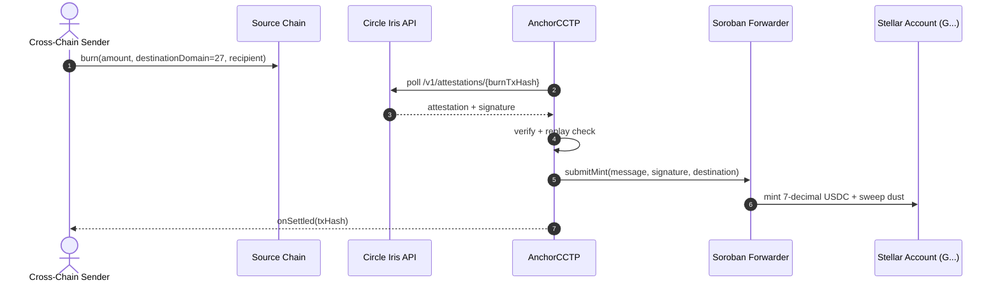

# How it works

For all readers: the eight steps every deposit follows, no matter which front end starts it.

1. Validate. You pass `sourceDomain`, `burnTxHash`, `destinationAddress`, and `amount`. The SDK rejects unknown domains and amounts that are zero, negative, or overflowed. It uses `bigint` only.
2. Replay check. The SDK lowercases `burnTxHash` and requires `0x` plus 64 hex characters. It looks up the normalized hash in the replay store. A hash seen before stops here with `REPLAY_TRANSFER`.
3. Poll attestation. The SDK calls the Circle Iris API with exponential backoff and jitter until status is `complete` or `maxRetries` runs out. Each attempt emits `onReceiving` with hash, status, and attempt count.
4. Verify. The SDK checks the Iris signature against Circle keys before it credits anything. A pending or malformed response never authorizes a mint.
5. Trustline ensure. The SDK reads the destination account for a USDC trustline. If the trustline is missing and you opted in with `allowCreation` plus `spendCapXlm`, it creates one. If you did not opt in, it throws `TrustlineMissingError` with a fix.
6. Submit mint. The SDK builds the forwarder call and hands the XDR to your `signer` callback. Your KMS, Freighter wallet, or sponsor service signs. The SDK never holds a secret.
7. Scale decimals. The SDK multiplies 6 decimal units by 10 to get 7 decimal stroops with integer math. It sends any sub stroop remainder to `dustCollectorAddress` and emits `onDustCollected`.
8. Settle. The SDK marks the hash processed in the replay store and emits `onSettled` with `amount`, `dust`, and `txHash`.

If a step fails, you get a typed error with a `code` and a `remediation` string. See [Events and errors](../core/events-errors).

Next: [Requirements](../start/requirements) lists what you need on your machine and accounts.
