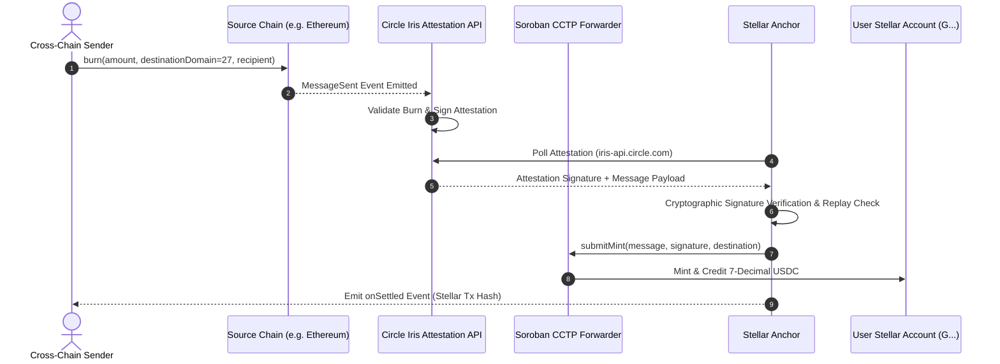

# SEP-CCTP: Cross-Chain Transfer Protocol (CCTP) Deposit Extension for Stellar Anchors

```
SEP: CCTP-0001
Title: Standardized CCTP Inbound Deposits for Stellar Anchors
Author: Mother's Grace (Juen) <juen@mothersgrace.dev>
Status: Draft
Type: Standards Track
Created: 2026-08-24
Discussion: https://github.com/stellar/stellar-protocol/discussions
```

---

## 1. Abstract

This Stellar Ecosystem Proposal (SEP) specifies a standardized mechanism for Stellar anchors to advertise and accept cross-chain USDC deposits via Circle's Cross-Chain Transfer Protocol (CCTP). By establishing unified `stellar.toml` metadata extensions, Soroban forwarder calling conventions, 6-to-7 decimal scaling standards, and cryptographic attestation verification protocols, this specification eliminates bespoke bridging silos and enables single-call cross-chain liquidity ingestion across 26+ connected blockchains.

---

## 2. Motivation

Circle's CCTP provides native 1:1 burn-and-mint transfers of USDC across supported networks (e.g. Ethereum, Base, Solana, Arbitrum, Avalanche, Polygon). However, differences between external chains and Stellar present several friction points for anchors and wallets:

1. **Decimal Precision Mismatch**: External chains represent USDC in 6 decimal places ($10^{-6}$), whereas Stellar native assets operate on 7 decimal places (1 Stroop = $10^{-7}$).
2. **Address Encoding**: EVM blockchains utilize 20-byte or 32-byte hexadecimal identifiers, whereas Stellar accounts are encoded as StrKey Ed25519 public keys (`G...`).
3. **Attestation Verification & Idempotency**: Anchors must verify Circle Iris signatures cryptographically and guard against replay attacks before crediting user balances.
4. **Anchor Discovery**: Wallets and cross-chain dApps require a standard discovery format to query an anchor's CCTP forwarder contract address, supported source domain IDs, and dust handling policies.

This SEP defines an open standard resolving each of these requirements.

---

## 3. Specification

### 3.1 Transfer Lifecycle

The standard CCTP inbound deposit flow comprises four sequential stages:



1. **Source Burn**: The user burns USDC on the source blockchain targeting Stellar CCTP Domain ID `27`. The recipient is encoded as a 32-byte payload representing the destination Stellar Ed25519 public key.
2. **Attestation Issuance**: Circle's Iris service monitors the burn event and issues a cryptographically signed attestation once source chain consensus/finality is reached.
3. **Attestation Retrieval & Verification**: The anchor or SDK client polls the Circle Iris API (`/v1/attestations/{burnTxHash}`) and verifies the signature against Circle's public Iris verifying keys.
4. **Forwarder Resolution & Mint**: The anchor invokes the Soroban Forwarder contract (`submitMint`) with the verified message and signature. The contract verifies the authorization payload and mints native Stellar USDC to the destination account.
5. **Settlement**: The anchor credits the deposit, scaling decimals from 6 to 7 and routing fractional dust if applicable.

---

### 3.2 Decimal Arithmetic & Dust Accounting

Stellar asset amounts are fixed-point numbers with 7 decimal digits of precision ($1 \text{ unit} = 10,000,000 \text{ stroops}$). Source CCTP chains utilize 6 decimal digits ($1 \text{ unit} = 1,000,000 \text{ base units}$).

To maintain mathematical fidelity:
- **Conversion Factor**: Every 1 source base unit equals 10 Stellar stroops.
$$\text{Stellar Stroops} = \text{Source Units} \times 10$$
- **Dust Calculation**: For non-integer or subdivided fractional amounts smaller than 1 source unit ($< 10^{-6}$):
$$\text{dust} = \text{rawUnits} \pmod{10}$$
- Any remaining sub-stroop dust is optionally swept to an anchor-designated `DUST_COLLECTOR_ACCOUNT` to ensure zero balance drift.
- Floating-point calculations are strictly prohibited; all conversions MUST use 64-bit integer or arbitrary-precision BigInt arithmetic.

---

### 3.3 `stellar.toml` CCTP Metadata Extension

Anchors advertising CCTP deposit support MUST publish the following extensions in their public `/.well-known/stellar.toml` file:

#### 3.3.1 `[[CURRENCIES]]` Extension

```toml
[[CURRENCIES]]
code = "USDC"
issuer = "GBBD47IF6LWK7P7MDEVSCWR7DPUWV3NY3DTQEVFL4NAT4AQH3ZLLFLA5"
cctp_domain = 27
cctp_forwarder = "CDLZFC3SYJYDZT7K67VZ75HPJVIEUVNIXF47ZG2FB2RMQQVU2HHGCYSC"
```

#### 3.3.2 `[CCTP]` Global Anchor Block

```toml
[CCTP]
CCTP_DOMAIN = 27
FORWARDER_ADDRESS = "CDLZFC3SYJYDZT7K67VZ75HPJVIEUVNIXF47ZG2FB2RMQQVU2HHGCYSC"
SUPPORTED_SOURCE_DOMAINS = [0, 1, 2, 3, 4, 5, 6, 7, 10, 11, 12, 13, 14, 16, 18, 19, 21, 22, 25, 28, 29, 30, 31, 32, 37]
DUST_HANDLING = "collector_sweep"
DUST_COLLECTOR_ACCOUNT = "GDDUSTCOLLECTOR00000000000000000000000000000000000000000000"
```

| Field | Type | Description |
|---|---|---|
| `CCTP_DOMAIN` | Integer | Destination CCTP Domain ID for Stellar (always `27`). |
| `FORWARDER_ADDRESS` | String (C...) | Soroban CCTP Forwarder contract address. |
| `SUPPORTED_SOURCE_DOMAINS` | Array[Int] | List of authorized Circle CCTP source domain IDs. |
| `DUST_HANDLING` | String | Strategy for handling dust (`collector_sweep` or `credit_destination`). |
| `DUST_COLLECTOR_ACCOUNT` | String (G...) | Stellar account designated to receive swept dust. |

---

## 4. Security Considerations

### 4.1 Replay Attack Mitigation
Every incoming CCTP message contains a unique source domain, nonce, and burn transaction hash. Anchors MUST record each processed `burnTxHash` in a persistent idempotency store before crediting funds. Subsequent requests containing an already-processed hash MUST be rejected immediately (`REPLAY_TRANSFER`).

### 4.2 Signature Verification Before Credit
Anchors MUST NEVER credit off-chain ledger balances or submit mint transactions based on unverified HTTP payloads. Cryptographic verification of Circle's Iris signature is mandatory prior to settlement.

### 4.3 Trustline Reserve Protection
If the destination account lacks a USDC trustline:
- Anchors MAY offer sponsored trustline creation.
- Sponsoring transactions MUST enforce an explicit spending cap (default $\le 2\text{ XLM}$) to prevent wallet draining attacks.

### 4.4 Domain Allow-Listing
To prevent unauthorized or fraudulent messages from experimental test networks, anchors MUST check incoming `sourceDomain` against the official allow-list of recognized domain IDs.

---

## 5. Backwards Compatibility

SEP-CCTP is fully backwards-compatible with existing Stellar Anchor standards:
- **SEP-6 / SEP-24**: Anchors may utilize SEP-CCTP as an automated deposit rail under existing deposit endpoint flows (`/deposit`).
- **SEP-38**: Anchors offering cross-asset exchange quotes may quote inbound CCTP USDC deposits directly to local fiat currencies.

---

## 6. Reference Implementation

A reference TypeScript implementation of SEP-CCTP is provided in the open-source AnchorCCTP repository:
- Core Engine: [`@anchor-cctp/core`](https://github.com/mothersgrace/anchorcctp-sdk)
- Terminal Suite: [`@anchor-cctp/cli`](https://github.com/mothersgrace/anchorcctp-sdk)
