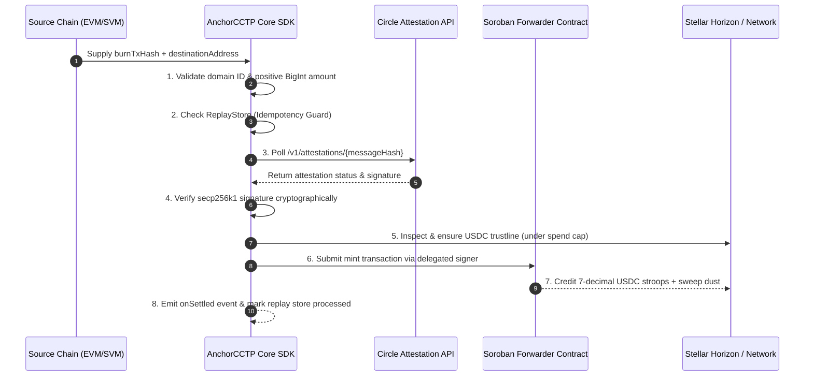

# @anchor-cctp/core-sdk

> Production-ready TypeScript core engine for Stellar Anchors & Wallets to ingest cross-chain USDC from 23+ CCTP-connected blockchains via a single unified API call.

[](https://www.npmjs.com/package/@anchor-cctp/core-sdk)
[](https://opensource.org/licenses/MIT)
[](docs/evidence/test-coverage-report.md)

---

## ⚠️ Security & Non-Audit Disclaimer

> [!CAUTION]
> **Non-Audit Disclaimer (PRD §7.10):**
> This SDK is provided as-is for integration acceleration and has **not** undergone a third-party security audit. While built following strict security invariants (zero private key persistence, mandatory cryptographic attestation verification, replay guards, BigInt-only math, and allow-listed domains), integrators and custody-grade operators must review all signing paths and test thoroughly before handling substantial production value.

---

## Key Features

- ⚡ **Single-Function Integration**: `sdk.receive()` orchestrates polling, address translation, decimal conversion, trustlines, and settlement.
- 🔐 **Zero Private Key Storage**: All transaction signing is strictly delegated to caller-supplied callbacks or sponsor secret managers.
- 🛡️ **Cryptographic Replay Guards**: Pluggable idempotency store prevents double-crediting of burn transaction hashes.
- 🔢 **Lossless BigInt Arithmetic**: $6 \to 7$ decimal scaling ($10^6 \to 10^7$) with sub-stroop dust rounding.
- 🌐 **Full 26 CCTP Chain Registry**: Built-in support for Ethereum (`0`), Solana (`5`), Base (`6`), Arbitrum (`3`), Stellar (`27`), and more.
- 📡 **Typed Lifecycle Event Pipeline**: Real-time event streams (`onReceiving`, `onSettled`, `onDustCollected`, `onError`).

---

## Architecture & Lifecycle



---

## Installation

```bash
npm install @anchor-cctp/core-sdk @stellar/stellar-sdk
```

---

## Quickstart Guide

```typescript
import { createAnchorCCTP } from '@anchor-cctp/core-sdk';

// 1. Initialize the Core SDK instance
const sdk = createAnchorCCTP({
  dustCollectorAddress: 'GDDUSTCOLLECTOR00000000000000000000000000000000000000000000',
  trustline: {
    allowCreation: true,
    spendCapXlm: 2.0, // Maximum XLM reserve spent for auto-trustline creation
  },
  signer: async (xdr: string) => {
    // Delegate transaction signing to your service account or Freighter wallet
    return mySigningService.sign(xdr);
  },
});

// 2. Subscribe to real-time lifecycle events
sdk.on('onReceiving', ({ burnTxHash, status, attempt, elapsedTimeMs }) => {
  console.log(`[CCTP Polling] ${burnTxHash} | Status: ${status} | Attempt #${attempt} (${elapsedTimeMs}ms)`);
});

sdk.on('onSettled', ({ amount, dust, txHash, destinationAddress }) => {
  console.log(`[Settlement Complete] Credited ${amount} stroops to ${destinationAddress} (Tx: ${txHash})`);
});

sdk.on('onDustCollected', ({ amount, collector }) => {
  console.log(`[Dust Swept] ${amount} sub-stroop dust routed to ${collector}`);
});

// 3. Process an inbound cross-chain deposit
async function handleDeposit() {
  const result = await sdk.receive({
    sourceDomain: 6, // Base (Domain ID 6)
    burnTxHash: '0x87a1c38e7f9b841a05234917f8a1290348719283471029834710928347109283',
    destinationAddress: 'GBBD47IF6LWK7P7MDEVSCWR7DPUWV3NY3DTQEVFL4NAT4AQH3ZLLFLA5',
    amount: 10_000_000n, // 10 USDC (6 decimals, in base units)
  });

  console.log('Deposit Result:', result);
  /* Output:
    {
      amount: 100_000_000n, // 10 USDC credited on Stellar (7 decimals)
      dust: 0n,
      txHash: 'SIGNED_TX_HASH...',
      settled: true
    }
  */
}
```

---

## API Reference

### `createAnchorCCTP(config?: AnchorCCTPConfig): AnchorCCTP`

Creates an instance of the SDK client.

#### Config Options (`AnchorCCTPConfig`):
| Property | Type | Default | Description |
|---|---|---|---|
| `rpcUrl` | `string` | Soroban Mainnet URL | Stellar Soroban RPC Endpoint. |
| `horizonUrl` | `string` | Horizon Mainnet URL | Stellar Horizon Endpoint. |
| `dustCollectorAddress` | `string` | Destination address | Stellar account designated to receive remainder sub-stroop dust. |
| `trustline.allowCreation` | `boolean` | `false` | Whether to automatically create missing USDC trustlines. |
| `trustline.spendCapXlm` | `number` | `2.0` | Maximum XLM reserve spent for trustline creation. |
| `signer` | `SignerCallback` | Optional | Async callback receiving XDR string and returning signed transaction XDR string. |

---

### `sdk.receive(params: ReceiveParams): Promise<ReceiveResult>`

Orchestrates the entire 11-step cross-chain settlement flow.

#### Parameters (`ReceiveParams`):
| Parameter | Type | Required | Description |
|---|---|---|---|
| `sourceDomain` | `number` | Yes | Circle CCTP domain ID of origin chain (e.g. `0` for Ethereum, `6` for Base). |
| `burnTxHash` | `string` | Yes | Source transaction hash containing the CCTP `MessageSent` event. |
| `destinationAddress` | `string` | Yes | Target Stellar address (`G...` Strkey or EVM 32-byte hex). |
| `amount` | `bigint` | Optional | Source USDC amount in 6-decimal base units ($1\text{ USDC} = 1,000,000\text{n}$). |
| `dustCollectorAddress` | `string` | Optional | Overrides default dust collector address for this call. |
| `signer` | `SignerCallback` | Optional | Overrides default transaction signer for this call. |
| `allowTrustlineCreation` | `boolean` | Optional | Overrides default trustline auto-creation policy. |

---

## Error Handling

All SDK errors inherit from `AnchorCCTPError` and include actionable remediation guidance:

```typescript
import { ReplayTransferError, AttestationTimeoutError, TrustlineCreationError } from '@anchor-cctp/core-sdk';

try {
  await sdk.receive(params);
} catch (err) {
  if (err instanceof ReplayTransferError) {
    console.error(`Replay blocked: Transaction ${err.burnTxHash} was already processed.`);
  } else if (err instanceof TrustlineCreationError) {
    console.error(`Trustline failed: ${err.message}. Remediation: ${err.remediation}`);
  } else {
    console.error('Unhandled AnchorCCTP error:', err);
  }
}
```

---

## Supported CCTP Domains

| Domain ID | Chain Name | Network Type | Standard USDC Decimals |
|---|---|---|---|
| **0** | Ethereum | EVM | 6 |
| **1** | Avalanche | EVM | 6 |
| **2** | OP Mainnet | EVM | 6 |
| **3** | Arbitrum | EVM | 6 |
| **4** | Noble | Cosmos | 6 |
| **5** | Solana | SVM | 6 |
| **6** | Base | EVM | 6 |
| **7** | Polygon PoS | EVM | 6 |
| **27** | **Stellar** | **Stellar (Classic & Soroban)** | **7** |
| **37** | X Layer | EVM | 6 |

*(All 26 mainnet & testnet domains included)*

---

## Security & Proof Invariants

- **Math Exactness**: Decimal conversion uses `BigInt` integer arithmetic exclusively ($S = 10C + D$), preventing floating-point rounding exploits.
- **Attestation Gate**: Mandatory cryptographic verification of Iris attestation signatures before contract interaction.
- **Replay Store**: Atomic check-and-set idempotency store ensures $|R(H)| \le 1$ for any transaction hash $H$.

For formal mathematical proofs, see [LOGIC_PROOF.md](../../LOGIC_PROOF.md) and [Test Coverage Report](../../docs/evidence/test-coverage-report.md).

---

## License

MIT © [Mother's Grace / Stellar Indonesia](LICENSE)
